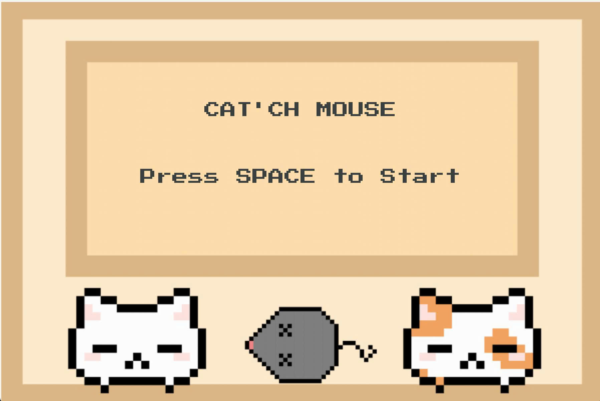

# Cat'ch Game 🐱

Đây là game tôi đã chuyển thành file đóng gói sẵn file chạy cho Windows bằng Pygbag.

## Cách chơi

- Game dành cho **2 người chơi**.
- Người chơi bên **trái** điều khiển bằng phím:
  - `W`: Di chuyển lên
  - `S`: Di chuyển xuống
- Người chơi bên **phải** điều khiển bằng phím:
  - Mũi tên **↑**: Di chuyển lên
  - Mũi tên **↓**: Di chuyển xuống
- Nhiệm vụ: Hứng bóng để ghi điểm.  
- Ai ghi được **5 điểm trước** sẽ thắng trận!

## Chạy game offline
1. Vào thư mục **dist** của repo này.
2. Tải file **main.exe** về máy của bạn.
3. Chạy **main.exe** để bắt đầu chơi game!

📝 Lưu ý:
- Nếu Windows cảnh báo khi mở file .exe, chọn "More info" → "Run anyway".

## Hình ảnh minh họa

## Ghi chú
- Game được viết bằng Python với thư viện Pygame.
- Được đóng gói sang file thực thi bằng PyInstaller.
